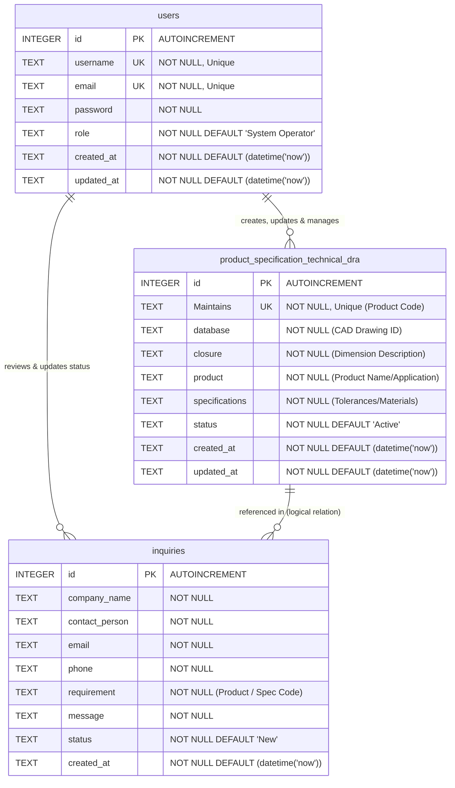

# Database Entity-Relationship (ER) Diagram & Schema Documentation

This document describes the database schema, data types, constraints, and relationships for the SV Closures Website.

---

## 1. Entity-Relationship (ER) Diagram

Below is the database ER diagram. It illustrates the tables (entities), their fields (attributes), keys (Primary and Unique), and their logical business relationships.

---

## 2. Detailed Schema Specifications

The system utilizes an **SQLite 3 database** file (`sv_closures.db`) configured with WAL (Write-Ahead Logging) mode and foreign keys enabled for concurrent access safety.

### 2.1. Table: `users`
Tracks authorized administrative and operational personnel who can manage specifications, view inquiries, and perform system configuration.

| Field Name | Data Type | Key / Constraint | Default Value | Description |
| :--- | :--- | :--- | :--- | :--- |
| `id` | `INTEGER` | PK, AUTOINCREMENT | *None* | Unique internal user identifier. |
| `username` | `TEXT` | UNIQUE, NOT NULL | *None* | Login username for authentication. |
| `email` | `TEXT` | UNIQUE, NOT NULL | *None* | Primary email of the operator. |
| `password` | `TEXT` | NOT NULL | *None* | Plain-text password (as per current design, could be hashed later). |
| `role` | `TEXT` | NOT NULL | `'System Operator'` | Permissions level (e.g., `'Quality Manager'`, `'System Operator'`). |
| `created_at` | `TEXT` | NOT NULL | `(datetime('now'))` | Timestamp of account creation. |
| `updated_at` | `TEXT` | NOT NULL | `(datetime('now'))` | Timestamp of last profile update. |

---

### 2.2. Table: `product_specification_technical_dra`
Stores product codes, CAD drawing indexes, dimension descriptors, and raw specification text files detailing material compositions and tolerance values.

| Field Name | Data Type | Key / Constraint | Default Value | Description |
| :--- | :--- | :--- | :--- | :--- |
| `id` | `INTEGER` | PK, AUTOINCREMENT | *None* | Unique specification identifier. |
| `Maintains` | `TEXT` | UNIQUE, NOT NULL | *None* | **Product Code** (e.g., `SV-CL-28MM`, `SV-BT-1L`). Pattern: `SV-CL-*` or `SV-BT-*`. |
| `database` | `TEXT` | NOT NULL | *None* | **CAD Drawing Reference** (e.g., `DRW-2026-001`). Pattern: `DRW-YYYY-NNN`. |
| `closure` | `TEXT` | NOT NULL | *None* | Basic closure dimension description (e.g., `28mm Beverage Cap`). |
| `product` | `TEXT` | NOT NULL | *None* | Full product application details (e.g., `Carbonated Soft Drink Closure Blue`). |
| `specifications` | `TEXT` | NOT NULL | *None* | Raw technical specs. Analyzed on-the-fly for tolerances & certificates. |
| `status` | `TEXT` | NOT NULL | `'Active'` | Lifecycle state (e.g., `'Active'`, `'Completed'`, `'Archived'`). |
| `created_at` | `TEXT` | NOT NULL | `(datetime('now'))` | Record creation date. |
| `updated_at` | `TEXT` | NOT NULL | `(datetime('now'))` | Last modified date. |

---

### 2.3. Table: `inquiries`
Captures public customer B2B requirements and queries submitted through the website portal.

| Field Name | Data Type | Key / Constraint | Default Value | Description |
| :--- | :--- | :--- | :--- | :--- |
| `id` | `INTEGER` | PK, AUTOINCREMENT | *None* | Unique inquiry identifier. |
| `company_name` | `TEXT` | NOT NULL | *None* | Name of requesting enterprise. |
| `contact_person` | `TEXT` | NOT NULL | *None* | Name of point-of-contact. |
| `email` | `TEXT` | NOT NULL | *None* | Contact email. |
| `phone` | `TEXT` | NOT NULL | *None* | Contact phone number. |
| `requirement` | `TEXT` | NOT NULL | *None* | Requested Product Code / description (e.g., `SV-CL-28MM`). |
| `message` | `TEXT` | NOT NULL | *None* | Custom specifications, volume needs, or questions. |
| `status` | `TEXT` | NOT NULL | `'New'` | Processing status (e.g., `'New'`, `'Reviewed'`, `'Archived'`). |
| `created_at` | `TEXT` | NOT NULL | `(datetime('now'))` | Date inquiry was submitted. |

---

## 3. Core Business & Relationship Logic

1. **User - Specification Management (`users` -> `product_specification_technical_dra`)**:
   - Logical One-to-Many (`1:N`) relationship.
   - Although no physical database foreign key constraint exists, updates are restricted to authenticated accounts with appropriate operational roles. `Quality Manager` and `System Operator` accounts perform CRUD actions, which are subsequently audited in database timestamp updates (`updated_at`).

2. **User - Inquiry Processing (`users` -> `inquiries`)**:
   - Logical One-to-Many (`1:N`) relationship.
   - Operators fetch collections of incoming inquiries and patch statuses (transitioning from `'New'` to `'Reviewed'` or `'Archived'`).

3. **Inquiry - Specification Reference (`product_specification_technical_dra` -> `inquiries`)**:
   - Logical One-to-Many (`1:N`) reference.
   - The public inquiry input form requires a `requirement` input. This text value is matched against active product codes (e.g. `SV-CL-28MM` in the `Maintains` column) to correlate customer interest with current drawing standards.

4. **Dynamic Metadata Extraction (Rules Engine Interaction)**:
   - When specifications are loaded or saved, the backend Rules Engine parses the `specifications` string to extract:
     - **Tolerance**: Parsed regex matches of type `± [value] mm`.
     - **Compliance status**: Derived using high-precision and safety thresholds (Warning if cap >0.1mm, Block if cap >0.3mm).
     - **Certification presence**: Scans for `FDA` / `USP Class` tokens based on `product` application types.
